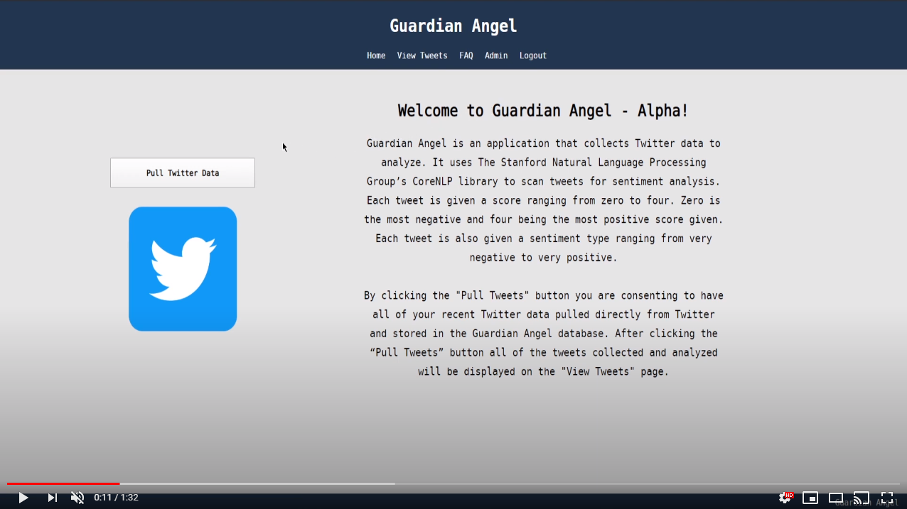
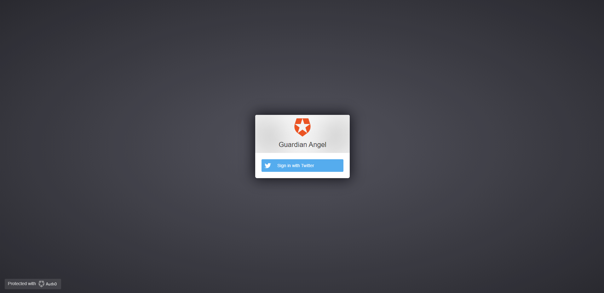
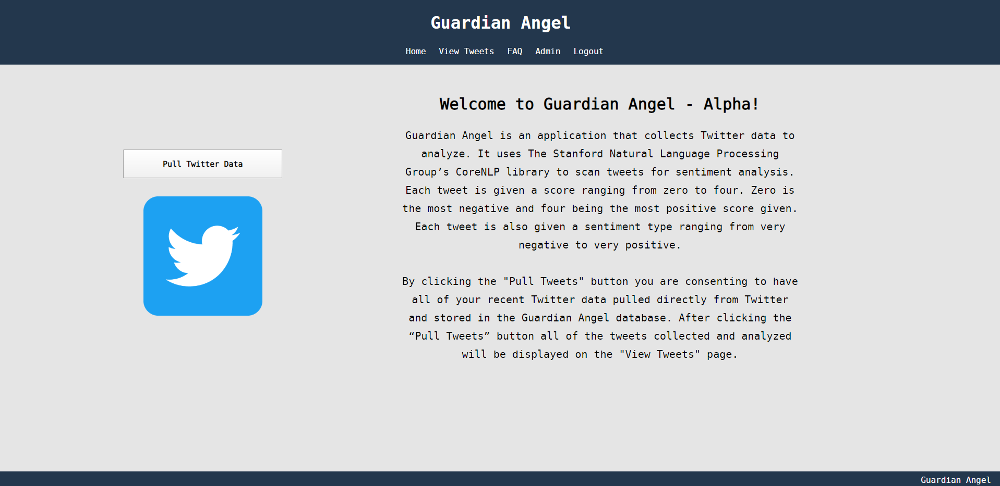
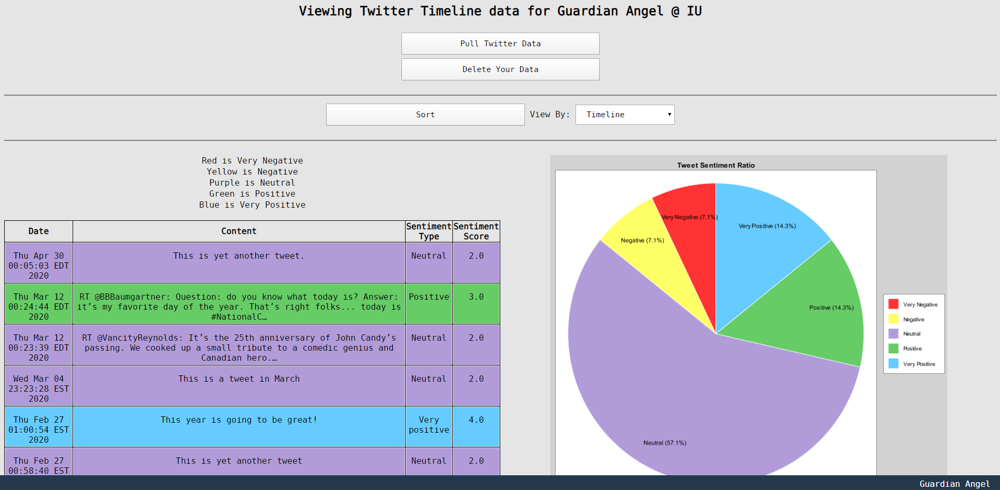
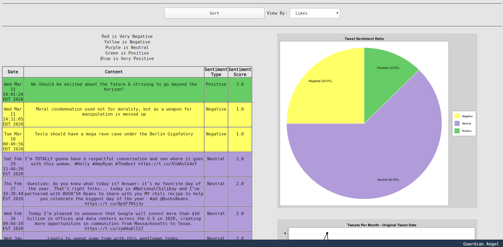
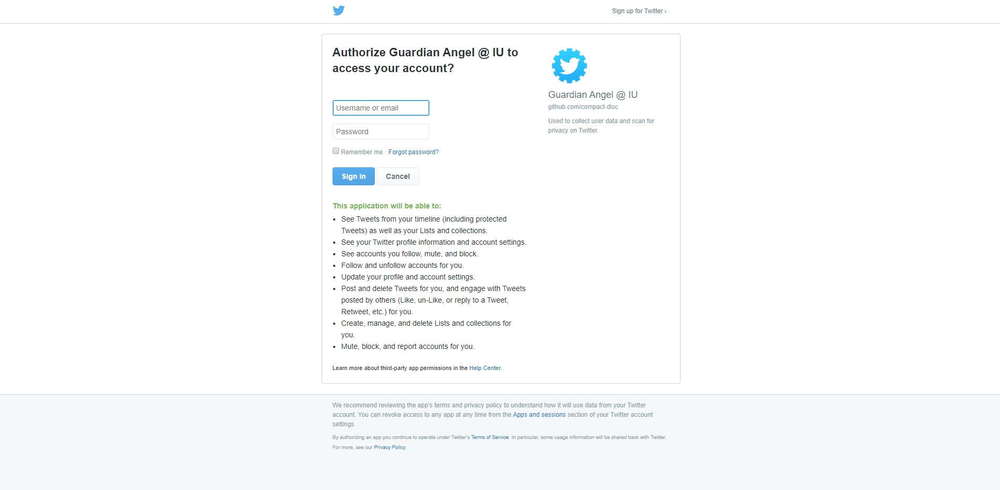
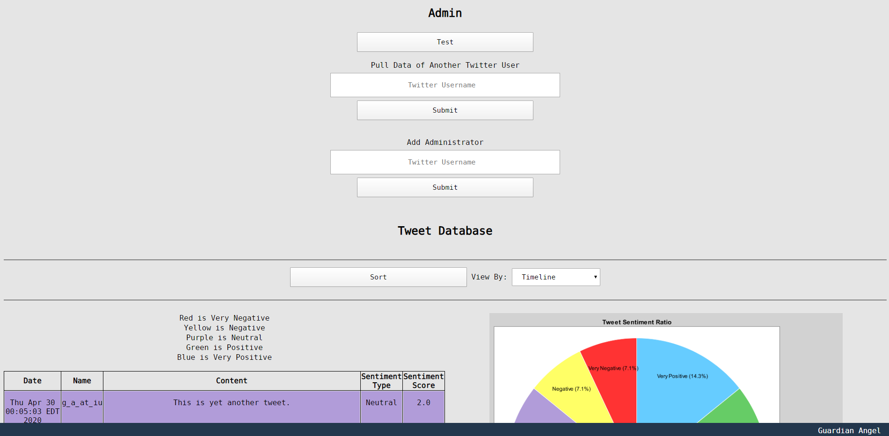
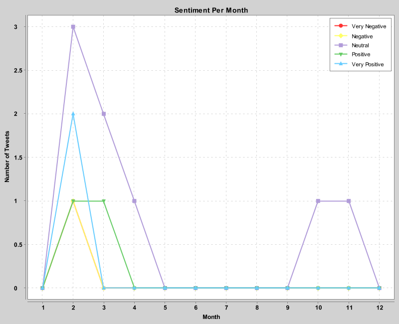
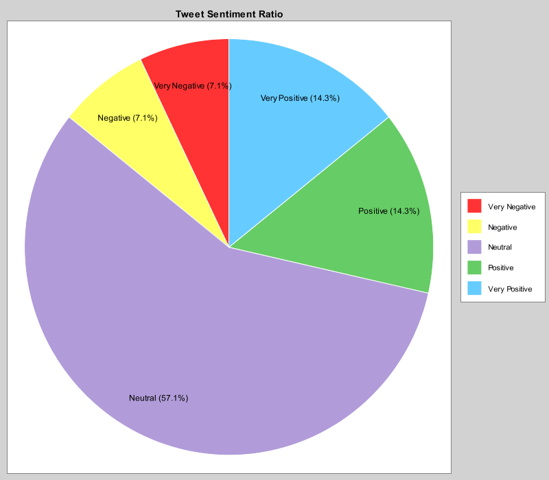

# Guardian Angel
An online tool to analyze your Twitter activity and visually report the results to you.

Version: 1.0.0

___

Indiana University-Bloomington

Christopher DeRoche, Computer Science, B.S.

Professor Apu Kapadia, Ph.D.

* Fall 2019
  * CSCI-Y 390 Independent Study (3 Credits)
* Spring 2020
  * CSCI-Y 390 Independent Study (3 Credits)
___

#### The Problem

With the fast-paced, evolving, and dynamic environment of social media use today user’s privacy is a major concern. Social media is currently flooded with notifications that do not monitor user’s online privacy. Social media platforms do not have a system in place to watch over the user’s activity internally or externally. In the case a post gathers substantial attention and the user is unaware of this; it can lead to significant implications that were unintentional. This is especially important to users with a large following. There is no built-in service on social media that currently checks for keywords, interactions or excessive popularity beyond regular user activity. Therefore, the risk of users losing control of their own online privacy is quite steep.

#### The Solution

The solution in theory is quite simple. Create an external monitoring and logging service to audit user activity regularly. This service will collect user data and put it against a dictionary of predefined phrases or words that could negatively impact a user. It will also collect statistics on individual posts, i.e., external user interaction, post statistics, post origins, etc. Data collected will be used to monitor irregularities that will be then sent to the user unlike standard notifications that are used internally by social media platforms.

___

#### Languages
* Java
* HTML
* CSS
* SQL

#### Libraries/Frameworks
* [Twitter4J](http://twitter4j.org/en/index.html)
  * Collect Twitter data.
* [Stanford Core NLP](https://stanfordnlp.github.io/CoreNLP/)
  * Analyze Tweets for sentiment.
* [XChart](https://knowm.org/open-source/xchart/)
  * Create user facing graphs using Tweet data.
* [Cloudinary](https://cloudinary.com/)
  * Upload and host user graph images.
* [Spring](https://spring.io/)
  * Application framework to run on the Java platform.
* [Spring Security](https://spring.io/projects/spring-security) and [Auth0](https://auth0.com/)
  * User authentication using social media login.
* [Thymeleaf](https://www.thymeleaf.org/)
  * HTML template engine for Java and Spring.
* [MariaDB](https://mariadb.org/)
  * Store user's Tweets for analyzing and displaying later.

#### Complete Documentation
* Created using Javadoc.
* Live version located at [https://compact-disc.github.io/guardianangel/javadocs](https://compact-disc.github.io/guardianangel/javadocs/).
___

#### Addtional Notes
* The Stanford Core NLP models are not included as they are too large for GitHub. They can be found [here](https://stanfordnlp.github.io/CoreNLP/).
* Stanford Core NLP [English models download](http://nlp.stanford.edu/software/stanford-corenlp-4.0.0-models-english.jar).
* API Keys for Twitter, Cloudinary, and Auth0 are removed.
* Truncated SQL file "guardian_angel.sql".

___

# Live Demo Video - Click to View

___

# Live Demo Images
#### Auth0 Login Page

#### Index of the Site

#### Viewing Tweets

#### Twitter OAuth Sign in

#### Administration Page

#### User Graph Examples (Generated using XChart)

